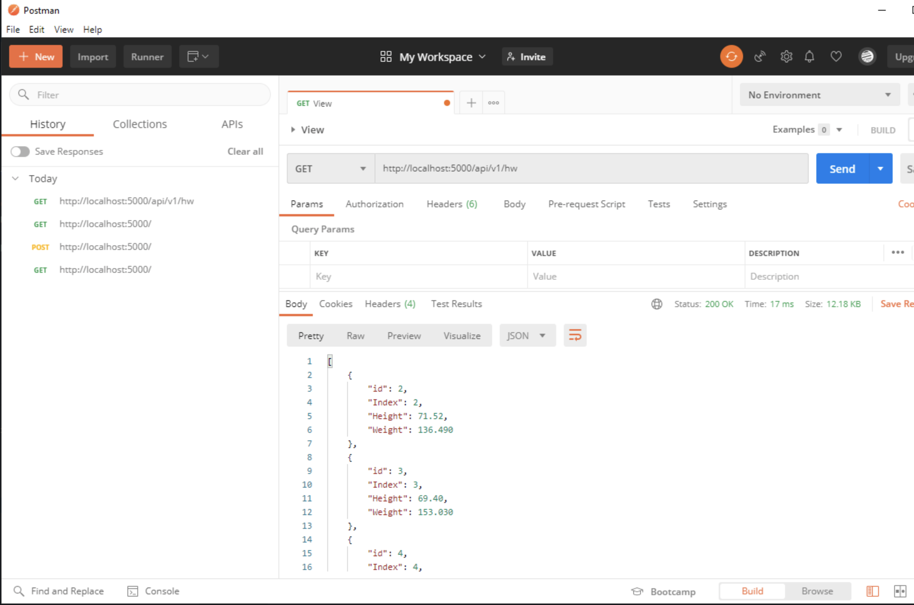
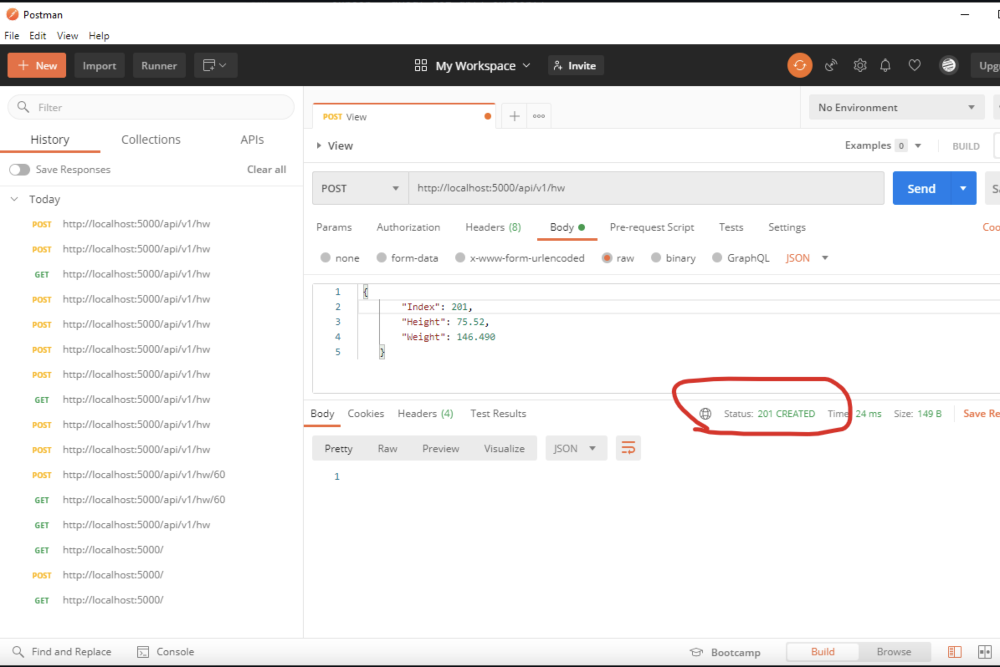
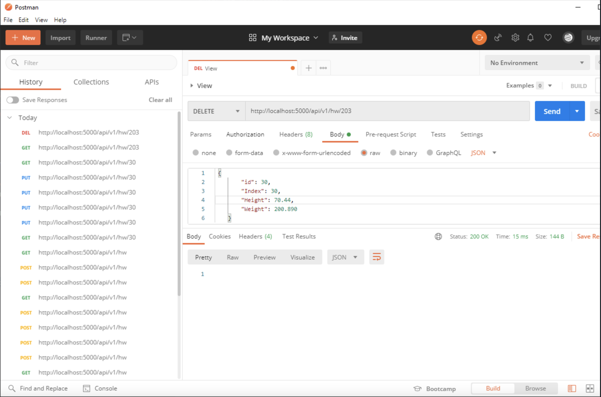
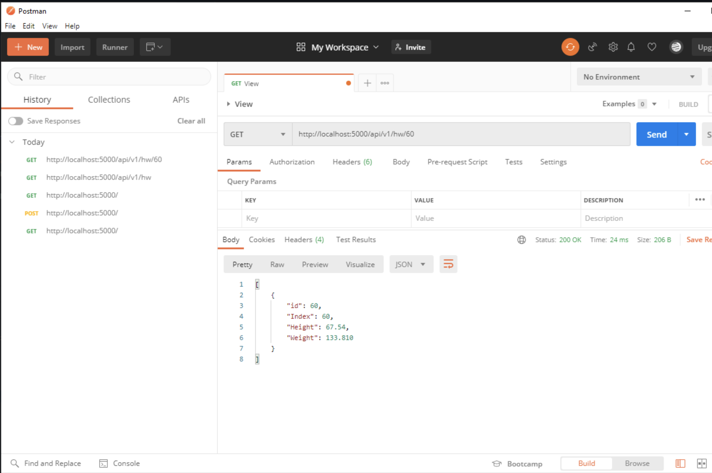
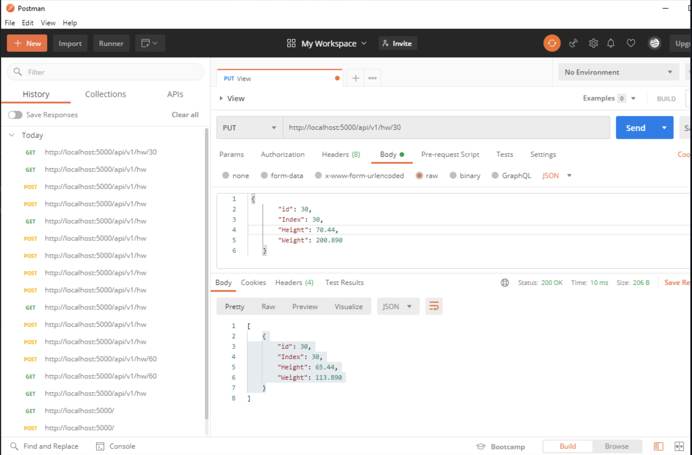

Pycharm Web App Part 4
This project is a homework assignment to get Pycharm to create a website and postman to view, edit, add, and delete records

# Running WebApp

# Table in Pycharm

# View Record

# Edit
 

# Delete 

# Postman View

# Postman Add

# Postman Delete

# Postman Single
 

# Postman Put

